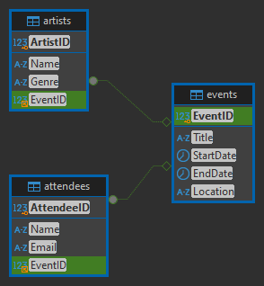
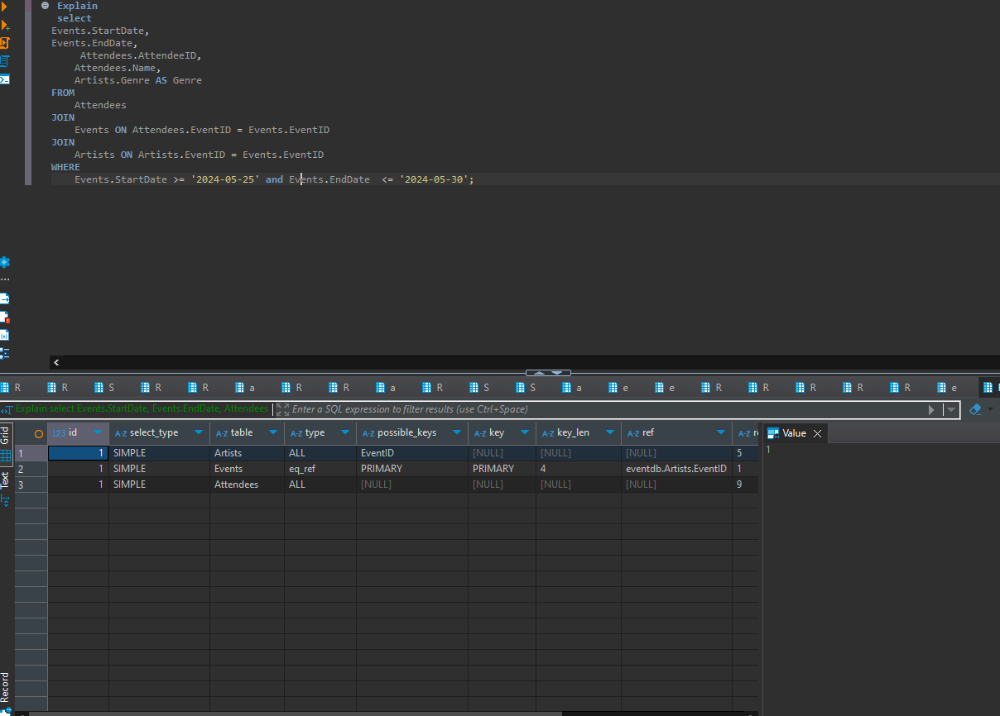

# Concert Database

### Concert Event
This database is designed to manage concerts, attendees, and artists. Below are detailed descriptions of the tables, initial data, and SQL queries.

```sql
-- Table for Events
CREATE TABLE Events (
    EventID INT PRIMARY KEY,
    Title VARCHAR(100),
    StartDate DATE,
    EndDate DATE,
    Location VARCHAR(255)
);

```
```sql
-- Table for Attendees
CREATE TABLE Attendees (
    AttendeeID INT PRIMARY KEY,
    Name NVARCHAR(50),
    Email NVARCHAR(100),
    EventID INT,
    FOREIGN KEY (EventID) REFERENCES Events(EventID)
);

```
```sql
-- Table for Artists
CREATE TABLE Artists (
    ArtistID INT PRIMARY KEY,
    Name NVARCHAR(100),
    Genre VARCHAR(100),
    EventID INT,
    FOREIGN KEY (EventID) REFERENCES Events(EventID)
);

```
## Database Setup for Tables
## Table: Events
This table contains information about concert titles, dates, and locations.
```sql
INSERT INTO Events (EventID, Title, StartDate, EndDate, Location)
VALUES
(1, 'ovo sound', '2024-05-22', '2024-05-23', 'Toronto'),
(2, 'Astroworld', '2024-05-24', '2024-05-25', 'Houston'),
(3, 'oblock', '2024-05-26', '2024-05-27', 'Chiraq'),
(7, 'weekday music', '2024-05-28', '2024-05-29', 'Vancouver'),
(5, 'weekend music', '2024-05-30', '2024-05-31', 'Stockholm');
```
```sql
  ## Table: Attendees
This table stores information about attendees of different concerts/events.

```
``` sql


INSERT INTO Attendees (AttendeeID, Name, Email, EventID)
VALUES
(123, 'Omar Hassan', 'fttax@gmail.com', 2),
(126, 'Mateo Calderon', 'mateocalde@gmail.com', 3),
(129, 'Zlatan Ibra', 'zlatan@gmail.com', 1),
(145, 'Leo Messi', 'Messi@gmail.com', 7),
(135, 'Cristiano Ronaldo', 'cr@gmail.com', 5);

```

```sql
## Table: Artists
This table describes the artist's name and genre.
``` sql
INSERT INTO Artists (ArtistID, Name, Genre, EventID)
VALUES
(6, 'Drake', 'Rap', 1),
(666, 'Travis Scott', 'Rap', 2),
(64, 'King Von', 'Rap', 3),
(23, 'The Weeknd', 'Pop', 5),
(15, 'The Weekday', 'RnB', 7);

```
## SQL Queries for Data Retrieval
Retrieve Attendees and their Event Genre

``` sql
SELECT
    Attendees.AttendeeID,
    Attendees.Name,
    Artists.Genre AS Genre
FROM
    Attendees
JOIN
    Artists ON Attendees.EventID = Artists.EventID;
``` 
## Retrieve Artists and their Event Locations
This query retrieves artists and the locations of their concerts.

```

``` sql
SELECT
    Artists.ArtistID,
    Artists.Name,
    Events.Location
FROM
    Events
JOIN
    Artists ON Events.EventID = Artists.EventID
JOIN
    Attendees ON Events.EventID = Attendees.EventID;
```

```sql
## Procedures for Data Entry
Create a Procedure for Adding Attendees
The AddAttendee procedure ensures that an attendee can be added but ignores duplicates if the attendee is already registered.

```
```sql
CREATE PROCEDURE AddAttendee (
    IN p_Name NVARCHAR(60),
    IN p_EventID INT,
    IN p_Email NVARCHAR(100),
    IN p_AttendeeID INT
)
BEGIN
    INSERT IGNORE INTO Attendees (Name, EventID, Email, AttendeeID)
    VALUES (p_Name, p_EventID, p_Email, p_AttendeeID);

    IF ROW_COUNT() > 0 THEN
        SELECT 'Attendee added successfully!' AS Message;
    ELSE
        SELECT 'Error: Event does not exist or attendee is already registered.' AS Message;
    END IF;
END

```


# Adding a User with Limited Permissions 

## Create a Limited User
```sql
CREATE USER 'limited_user'@'localhost' IDENTIFIED BY 'your_password';

```

## Grant the User Limited Access  
```sql
GRANT SELECT ON eventdb.Events TO 'limited_user'@'localhost';

``` 

## Verify the User's Permissions
```sql  
SHOW GRANTS FOR 'limited_user'@'localhost';

```


# ER Diagram 



## Performance Analysis 

Here is the SQL query to optimize performance for retrieving all attendees attending a concert between 2024-05-25 and 2024-05-30.
 
 ```sql
 Explain
 select 
Events.StartDate,
Events.EndDate, 
     Attendees.AttendeeID,
    Attendees.Name,
    Artists.Genre AS Genre
FROM
    Attendees
JOIN
    Events ON Attendees.EventID = Events.EventID
JOIN
    Artists ON Artists.EventID = Events.EventID
WHERE
    Events.StartDate >= '2024-05-25' and Events.EndDate  <= '2024-05-30';
```
   The result was not as expected, and it appears that there is insufficient data in the database for optimization.

 
 



# Backup and Restore

## Database Backup via Command Line


## Restoring the Database to a Newly Created Database


